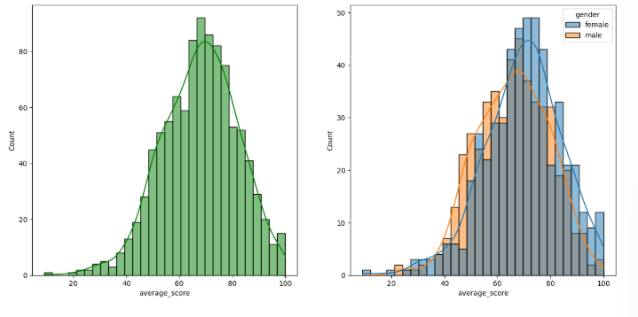
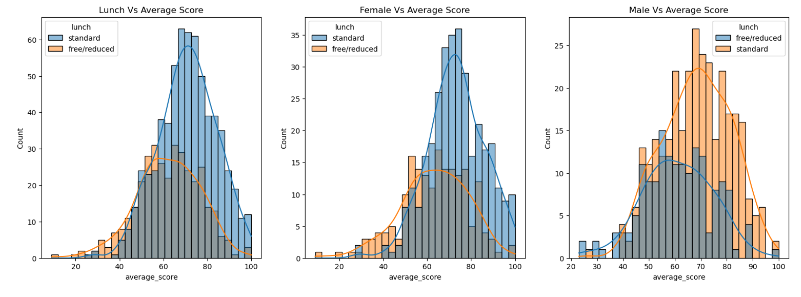
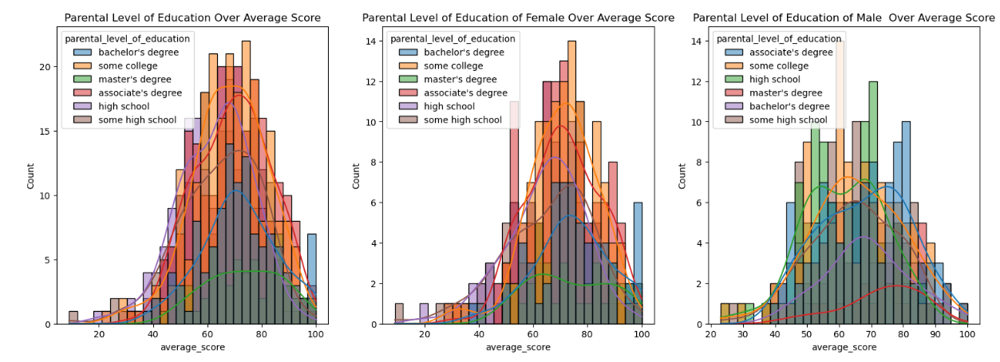
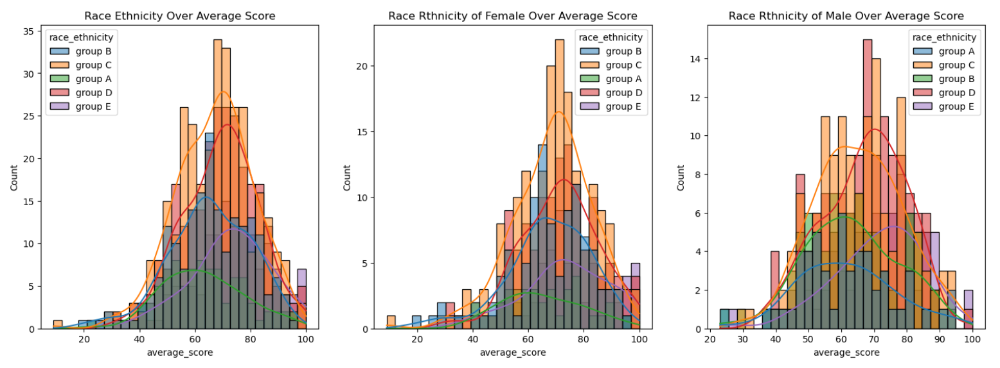
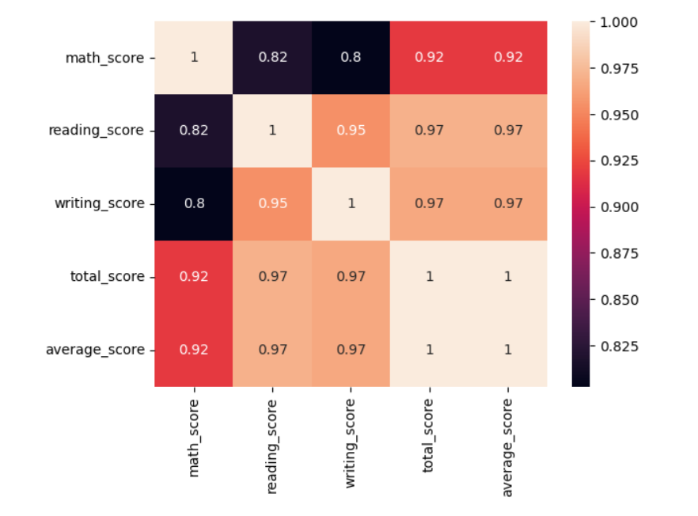

# EDA Student Performance Indicator
### 1) Problem Statement
This project understands how the student's performence (test scores) is affected by other variables such as Gender, Ethnicity, parental lavel of education, Lunch and Test preparation course.
### 2) Data Information
    The Data consists of 8 columns and 1000 rows.
    gender : sex of the students -> (male/female)
    race/ethnicity : ethnicity of students -> (Group A,B,C,D,E)
    parental level of education : parent's final education -> (bachelor's degree, some college, master's degree, associate's degree, high school)
    lunch : having lunch before test(standard or free/reduced)
    test preparation course : complete or not complete before test
    math score
    reading score
    writing score

### 3.Data Checks to perform
    - Check missing values
    - Check Duplicates
    - Check data type
    - Check the number of unique values of each column
    - Check statisics of the data set
    - Check various Categories in the different categorical column

## Insights or Observation
    - There are no missing values
    - There are no duplicates values in the dataset
    - From the above description of numerical data, all means are very close to each other- between 66 and 69.
    - All the standard deviation are also close - between 14.6  - 15.19.
    - While there is a minimum of 0 for the maths, other having 17 and 10 value.

    -  Female Student tend to perform well than male students

    - Standard Lunch helps students perform well in exams
    - Standerd Lunch helps perform well in exams be it a male or female

    - In general parent's education don't help students perform well in exam.
    - 2nd plot we can see there is no effect of parent's education on frmale students.
    - 3rd plot shows that parent's whose education is of associate's degree or master's degree their male child tend to perform well in exam. 

    - Students of Group A and Group B tends to perform poorly in exam.
    - Students of Group A and Group B to perform poorly in exam irrespective of whether they are Male or Female

